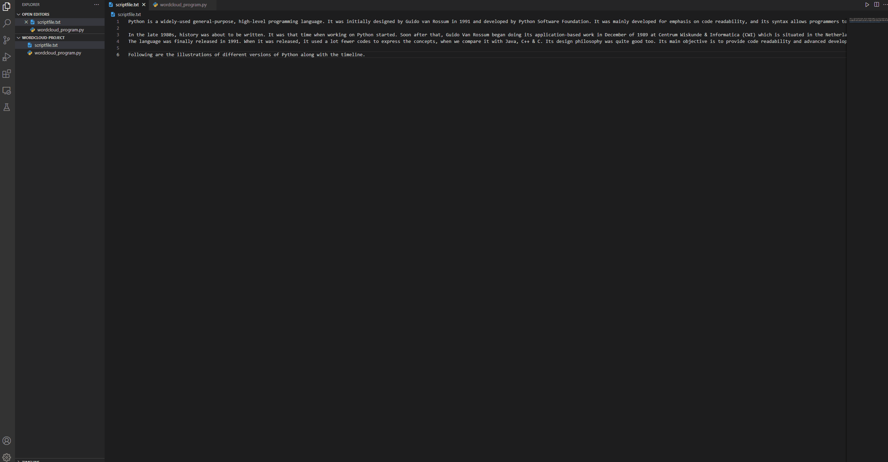

# WordCloud Project

## Table of Contents

1. [Overview](#Overview)
2. [Product Spec](#Product-Spec)
3. [GIF](#GIF)

## Overview

**Goal**

To create a "word cloud" from a text by writing a script. 

**Description**

This script needs to process the text, remove punctuation, ignore case and words that do not contain all alphabets, count the frequencies, and ignore uninteresting or irrelevant words. A dictionary is the output of the calculate_frequencies function. The wordcloud module will then generate the image from the dictionary.

For the input text of the script, a textfile that contains text only is needed. 

## Product Spec

- [x] File upload and file read functionality
- [x] A filter to remove punctuation, ignore case and words that do not contain all alphabets, count the frequencies, and ignore uninteresting or irrelevant words. 

## GIF

